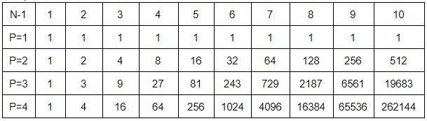

## Compound scoring

Compound scoring provides a layer of sophistication beyond that achievable using simple bonus values and is provided here by the use of categories. Each ordinary bonus is labelled with up to nine categories, one for each of nine sets. The sets might represent counties, countries, modes of transport, pretty much anything the Rallymaster wishes to use. In BBR17 two sets were used being county & country; BBR18 had region and category. Each set contains an arbitrary number of categories (individual counties, etc).

Scores based on categories use one of two values N: either the number of bonuses visited in a particular category(NC) or the number of categories scored(NZ).

Compound scoring caters for both points values and multipliers which, as the name suggests, are used to multiply an underlying points score.
### Bonus value modification  
The first compound method modifies individual bonus scores by participation in one or more categories.

In BBR17 the county set was used to modify the bonus points values in accordance with the number of bonuses visited in each county (N=NC). Individual bonuses each had a basic points value (bpv) of 1 but their actual points value (apv) is given as:-

apv = bpv x PN-1

Where P is the power base chosen for the set (2 in BBR17) and N is the number calculated above. So for example the third bonus scored in Yorkshire was worth 1 x 2^2 = 4 and the fourth bonus was 1 x 2^3 = 8.

Multiplier values  

**Caution**: When using the bonuses visited per category, NC, method, ordinary bonuses should all have the same points value because if they were different (except for P=1) the order of scoring, at the table, would become significant. It is sensible to have differing points values for bonuses in different categories, so, for example, bonuses visited in Lanarkshire could be worth more than bonuses visited in Somerset.

When using NZ the individual bonus values are not used and are replaced in the formula with 1. The score is dependent on the number of categories having a bonus scored in an set.

Setting P=0 would result in a score of zero for all affected bonuses using the above formula so instead a value of 0 offers a different, simpler, formula:- apv = bpv x (N-1).

### Set/category scoring  
Instead of (or in addition to) modifying the bonus values, categories can be used for a second layer of scoring and in this case can be used either to calculate an additional points value or a multiplier. Category scores can be calculated using either NC or NZ values as above.  BBR18 used this method to apply region & category bonuses.

---

### Super combinations  
Categories can also be used to implement advanced combinations. It might be easier to implement a combo involving, say, 50 ordinary bonuses in this way rather than specifying a specific combination. Bonuses can be easily included/excluded by changing the one field on the bonus record rather than altering the combination's bonus list.

It's also possible to specify conditions such as "*must score at least 3 cats*" and "*must not score more than 5 cats*".

[Examples of compound scoring configuration](help:scoringoptions)

