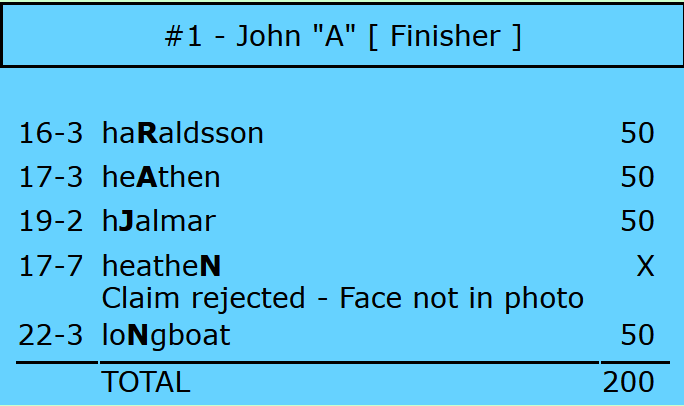

## Score explanation
The scorecard itself is designed to capture both successful and unsuccessful bonus claims and is laid out to facilitate data capture (bonus claims) and data control (knowing whether or not claims have been processed). The explanation is available for viewing on screen and may also be printed off for some or all entrants by the Administrator.

When a claim is recorded as unsuccessful it has an associated ‘reason’ which is actually one of the nine texts held in the RALLYPARAMS database table. This reason is included as part of the explanation in the score log so that anyone reading the log will have a basic  understanding of the rejection.

This explanation will show ordinary bonuses in the order in which they were entered, typically the order in which they were visited. Right-clicking the explanation will show only the ordinary bonuses, enabled to be re-ordered using drag and drop. A button is also provided to sort them into ascending order of bonus id.
